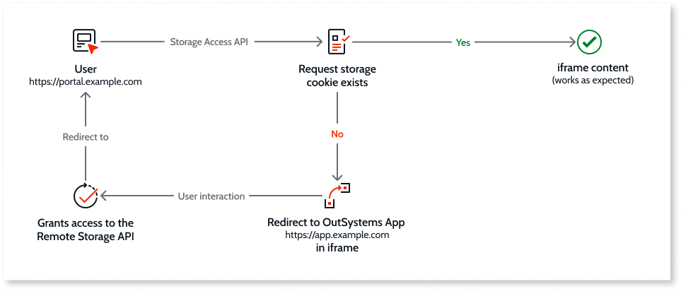

# Troubleshooting OutSystems apps on iOS devices

Since the release of [MABS version 6.0](https://success.outsystems.com/Support/Release_Notes/Mobile_Apps_Build_Service/MABS_Version_6.0), **OutSystems** mobile apps require a custom scheme in iOS in order to

* Enable offline support with WKWebView
* Navigate to other **OutSystems** mobile applications
* Access other **OutSystems** mobile applications with InAppBrowser 

For Android and InAppBrowser windows, **OutSystems** native mobile apps run under the `https://` scheme. On iOS the `outsystems://` scheme is used.

Since `outsystems://` is a custom scheme, it must be specifically added to the authorization list. To embed an app in an iframe on an **OutSystems** native mobile app, add the following to the **frame-ancestors** directive field:

```
outsystems://YOUR_APP_URL
https://YOUR_APP_URL
```

## Common problems with embedded iframes in iOS apps

### iframe content is blocked

If iframe content displays as expected on Android on a browser but not on iOS, the most probable cause is that the custom `outsystems://` scheme is missing.

Add the following to the **frame-ancestors** directive field:

```
outsystems://YOUR_APP_URL
https://YOUR_APP_URL
```

You can get more information if you notice this behavior from the **Service Center**  [monitoring page](#monitoring). You can identify the issue by searching the **Interrupting main resource load due to CSP frame-ancestors or X-Frame-Options** error log.


### iframe content is displayed but does not behave as expected

With the [version 2.3](https://webkit.org/blog/9521/intelligent-tracking-prevention-2-3/) release of Apple’s Webkit Intelligent Tracking Prevention (ITP) in 2017, Safari on iOS 13 and iPadOS beta, and Safari 13 on macOS, blocks all cookies for cross-site resources by default.

In these browsers iframe content displays correctly when the **frame-ancestors** directive field has been configured properly. However, an app that requires cookies to save or transfer user info will not behave as expected.

An example of this behavior is shown below:

1. An end-user logs into a portal page (`https://portal.example.com`) which has authentication mechanisms to create first-party cookies.
1. An **OutSystems** app in an HTML iframe (`https://app.example.net`), which is on a different domain, attempts to create third-party cookies. The Safari browser blocks these cookies and the content in the iframe does not behave as expected.


<div class="info" markdown="1">

You can read more about this issue in the [Safari Blocks Third-Party Cookies by Default](https://www.infoq.com/news/2020/04/safari-third-party-cookies-block/) InfoQ newsletter.

</div>

In March 2020, Apple published a blog post ([Full Third-Party Cookie Blocking](https://webkit.org/blog/10218/full-third-party-cookie-blocking-and-more/)) that suggested two workarounds to address developer concerns about legitimate third-party cookies, such as those used by **OutSystems** to store login and session information. 


#### OAuth 2.0 Authorization

One method requires the end-user to authenticate third-party apps (such as `https://app.example.net` in an iframe) to forward an authorization token to a hosting website which can then establish a first-party login session.

For more information about implementing this solution see the following documents:

* [OAuth 2.0 Authorization](https://tools.ietf.org/html/rfc6749) 
* [Using HTTP Cookies](https://developer.mozilla.org/en-US/docs/Web/HTTP/Cookies#Secure_and_HttpOnly_cookies)
* [Manage cookies and website data in Safari on Mac](https://support.apple.com/en-gb/guide/safari/sfri11471/mac)


#### Storage Access API

A second method relies on Apple’s Webkit [Storage Access API](https://webkit.org/blog/11545/updates-to-the-storage-access-api/) that protects end-user privacy and prevents cross-site request forgeries by asking users to consent to giving access to their cookies from one domain to another.

The following workflow provides a natural experience with minimum friction for a first-time users of a portal page (`https://portal.example.com`) with an app (`https://app.example.net`) embedded in an iframe.

1. The user accesses the portal page (`https://portal.example.com`).
1. A script checks if the browser supports Storage Access API and if storage access has been requested.
1. If no cookie for storage access has been created, the user is directed to (`https://app.example.net`) in the iframe.
1. The user interacts with the iframe app as the first party and establishes it as visited for the purposes of the underlying Storage Access API cookie policy. For this session, and during every subsequent visit, the content in the iframe behaves as expected.
1. The user is then forwarded to the portal page (`https://portal.example.com`).



Designers may use the following code snippets to implement a solution based on Storage Access API.

<div class="info" markdown="1">

Change URLs to reflect actual project addresses. 

</div>


##### Portal page

Include the following elements on the portal page (`https://portal.example.com`):


* A sandbox within the iframe element. Sample text is shown below: 

```HTML
    <iframe
      frameborder="0"
      style="border:0"
      class="responsive-iframe"
      src="https://app.example.net"
      sandbox="allow-storage-access-by-user-activation allow-scripts allow-same-origin">
    </iframe>
```
* A script that checks if the browser supports Storage Access API, sets cookie properties, and then navigates to the hosted **OutSystems** app in the iframe.

```javascript
<script>
     // Check if the browser (i.e. Safari) supports the Storage Access API by checking if the document.requestStorageAccess method is defined.
     if (document.requestStorageAccess) {
         // See if cookie exists (https://stackoverflow.com/a/25617724/1502448)
         if (!document.cookie.match(/^(.*;)?\s*fixed\s*=\s*[^;]+(.*)?$/)) {
             // Set cookie to maximum (https://stackoverflow.com/a/33106316/1502448)
             document.cookie = 'fixed=fixed; expires=Tue, 19 Jan 2038 03:14:07 UTC; path=/';
             // Navigate to interaction screen at the first party. In our case, the screen with the button that created the cookie
             window.location.replace("https://app.example.com");
        }
    }
 <script>
```

##### iframe app

The hosted **OutSystems** app in the iframe element (`https://app.example.net`) should begin with a mechanism for the user to authorize the use of cookies.

See [Introducing Storage Access API](https://webkit.org/blog/8124/introducing-storage-access-api/) for a detailed explanation about implementing this solution.
