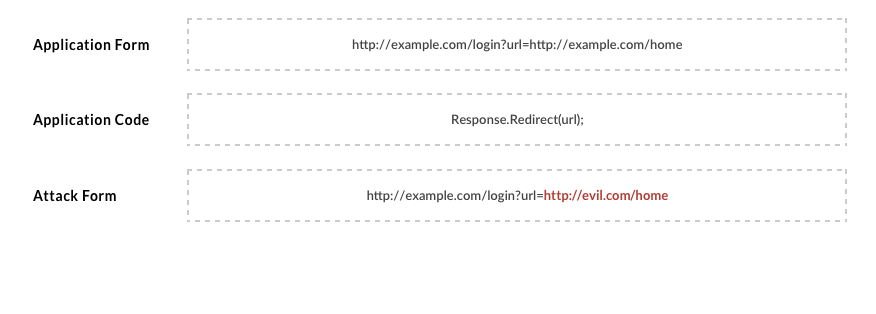

# Protecting OutSystems Apps From Redirects / Forwarders Vulnerabilities

Attackers can trick users by taking advantage of unvalidated redirects or forwarders. In these cases victims trust your URL but are redirected to a malicious site.

When applications redirect users to other pages using dynamic URLs in its parameters, it allows attackers to provide a valid URL with a redirect parameter to a malicious site.

The following example from the [OWASP documentation](https://www.owasp.org/index.php/Top_10_2013-A10-Unvalidated_Redirects_and_Forwards) shows how an unvalidated redirect can be exploited to send a user to a malicious site.

## How to do it with OutSystems

To prevent attackers from using unvalidated redirects or forwarders, the following actions are recommended:

|**Use case** |**Actions** |
|-------------|------------|
|Use Dynamic URLs redirects from input parameters |**To prevent attackers from using unvalidated redirects or forwarders, avoid using dynamic URL external sites**   If you absolutely must use them, then check the input URL against a allowlist. |

To learn how to protect your OutSystems apps against other common types of attacks, check [how OutSystems helps you develop secure applications](intro.md).
