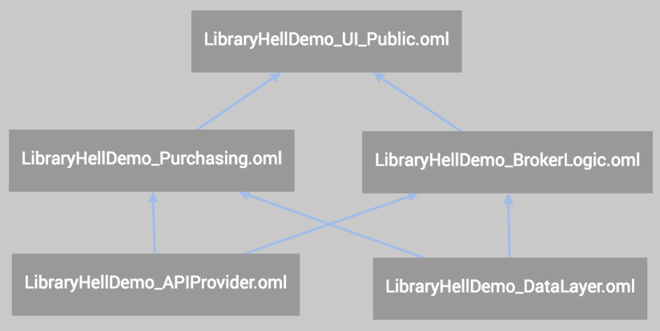
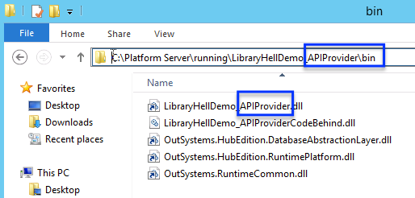
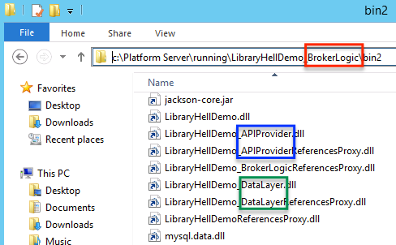

# Library hell - why are changes in a producer not reflected in the consumers

If one is developing in multiple modules at a time, it may happen that a change is made to a producer module (for example, at an integration level) and there is the need to see the change reflected in a consumer module. In some situations, simply republishing the consumer module solves the problem. But in others, the changes don't get reflected in the consumers. 

This situation can be time-consuming and lead to frustration by the developer - who may believe there is a problem with their code and trigger a wild goose chase. 

Most of the times this problem happens is because of a reason: Library hell. This is something that can happen as your OutSystems application becomes more complex, with more levels of consumer/producer modules. Library Hell is a generalization of concepts already in use in the software industry, which are the root cause of the behavior (particularly DLL hell and Jar hell).

This article explains:

- What the concept means (both in the context of the native technologies and from an OutSystems applications perspective)

- Common pitfalls and dealing with them;

- Avoiding or dealing with the problem.

## The basics of deployment for an OutSystems application

OutSystems applications are `standard .NET or Java applications`. In .NET, applications are deployed in IIS by deploying each module as a separate Virtual Directory or VDir; in Java, they're deployed in either JBoss or Weblogic by deploying each module as a separate WAR application.

## Understanding how the platform deploys modules

In OutSystems it's possible to create dependencies between applications by creating references between modules; it's also possible to use Extensions to create integrations with native code and import data from external systems.

When references are used, the module or Extension that exposes the references is called a **Producer**; the module that imports the reference is called a **Consumer**.

When an OutSystems application using references is deployed, the libraries of each producer are deployed with the consumer. In .NET, libraries are DLL files - a set for each producer; in Java, libraries are JAR files - again, a set for each producer.

## A practical example

For better understanding these concepts, a practical example can be useful. In this document, we'll use a sample application with producers and consumers. The sample application is available [here](resources/LibraryHellDemo.osp).

The structure of the application is as follows:

Image 1: Application structure

Explaining the application:

- **APIProvider** is a bottom-line producer: it exposes calls to public API

- **DataLayer** is a bottom-line producer: it exposes the data of the application

- **BrokerLogic** consumes both **APIProvider** and **DataLayer** to provide actions to list products

- **Purchasing** consumes both **APIProvider** and **DataLayer** to provide actions to buy products

- **UI_Public** is the front-end used by customers 

Based on the example above, we'll describe some scenarios and explain what happens when the platform deploys the above application.

### What libraries exist in each module?

In an IIS VDir / Java WAR, for each of the modules of the sample application, the following libraries are present:

- **APIProvider**: only itself

- **DataLayer**: only itself

- **BrokerLogic**: itself, APIProvider, DataLayer

- **Purchasing**: itself, APIProvider, DataLayer

- **UI_Public**: itself, APIProvider, DataLayer, BrokerLogic, Purchasing

A library being present means that the DLL (.NET) or JAR (Java) are present in the deployment unit (IIS VDir / Java WAR).

Below are three examples:

* **APIProvider**: its library is in side the running folder for APIProvider, inside **bin**:

Image 2: APIProvider library in the module's IIS VDir / Java WAR

* **BrokerLogic**: in a consumer, producer libraries are inside a **bin2** folder. Here you can see that the libraries for **APIProvider** and **DataLayer** , the producers for **BrokerLogic**:

Image 3: Producer modules' libraries in BrokerLogic module's IIS VDir / Java WAR

* **UI_Public**: again in the **bin2** folder; in this one, all the libraries are there: for **APIProvider,** **DataLayer**,  **BrokerLogic** and **Purchasing**:

Image 4: Producer modules' libraries in UI_Public module's IIS VDir / Java WAR

In conclusion: for any module in the system, libraries for it can be found:

* For the own module IIS VDir / Java WAR, in the **bin** folder (IIS VDir) or under **WEB-INF/lib**(Java WAR);

* In each of the consumer modules IIS VDir / Java WAR, in the **bin2** folder (IIS VDir) or under **WEB-INF/lib**(Java WAR).

When a request is running in the context of a consumer module, calls to actions from the producers use the local copies of libraries (under bin2) and not the original copy in the producer module's IIS VDir / Java War. In the example above, a call to APIProvider from BrokerLogic uses the file in Image 3; but if that call is made from UI_Public, then the file in Image 4 is used instead. If you delete the APIProvider file from Image 4, calls to APIProvider logic from UI_Public start to fail, but calls from BrokerLogic will still work.

### Changing producers

Because of how code from producers is called, if I change the code of a producer, the change is only reflected in a consumer after that consumer has been republished.

*Meaning*: if I change **APIProvider** and publish it, **UI_Public** doesn't get refreshed automatically - it's still using the previous library for it. Technically, only the IIS VDir / Java WAR for **APIProvider** was changed; the IIS VDir / Java WAR for **UI_Public** remains unchanged, with the previous versions of all libraries.

To test this scenario using the sample application:

* Access `http://<myserver>/UI_Public/` . There is an option to purchase items. Upon purchase, a feedback message is returned. This message is obtained from using the *Echo* action from **APIProvider**.
In this version, *Echo* returns the input as output;

* Change the output of *Echo* in **APIProvider** to prepend "Simon says:" at the beginning of the output. Publish the new version APIProvider;

* Access `http://<myserver>/UI_Public/` again. A new purchase still doesn't echo "Simon says". This happens because the library used in **UI_Public** is still the previous one.

To try to fix this scenario, the obvious solution could be to simply publish **UI_Public** again, so the change gets reflected. However, this isn't true.

You can test it yourself:

* In Service Center, republish the latest version of UI_Public.

* Access `http://<myserver>/UI_Public/` again. The echo still doesn't have the "Simon says" part.

You can repeat publish a few more times - it doesn't change anything.

## Multiple levels of producers

The reason republishing **UI_Public** doesn't fix this problem is because: **UI_Public** isn't a direct consumer of **APIProvider.**

This is relevant because of the way the platform obtains libraries of producer modules:

* When the platform publishes an module, it obtains dependency libraries from its direct producers.
*In our example*: since the two producers of **UI_Public** are **BrokerLogic** and **Purchasing**, the platform will obtain libraries from them;

* If the platform needs further libraries (producer of producer) they will be obtained from the direct producers.
*In our example*: all the libraries needed by **UI_Public** will be obtained directly from either **BrokerLogic** and **Purchasing**, not anywhere else.

Since there was no republish of **BrokerLogic** or **Purchasing**, their version of **APIProvider** library is still the old one. That version is the one included in **UI_Public** when it's published, and so it continues to use the outdated version.

Service Center warns about this: when republishing **UI_Public**, one gets warnings that both **BrokerLogic** and **Purchasing** are outdated. You also get the warning that **UI_Public** will be outdated when you published **APIProvider** initially.

An important question arises:

**_From which producer (_****_BrokerLogic_****_ or _****_Purchasing_****_) is the platform obtaining the libraries for APIProvider?_**

The answer is: in this case, **it's undefined**.

How does it work generically for the platform?

* If an module / Extension is a direct producer, the library is obtained directly from it;

* If an module / Extension isn't a direct producer, but is only a producer of one of the direct producers, that's the place where the library comes from.
*In our example*: if only **BrokerLogic** consumed **APIProvider**, the library for APIProvider would come from **BrokerLogic**;

* If (*as our example*) the module / Extension isn't a direct producer and is a producer of more than one of the direct producers, then **the library can come from any of the producers that consume it**.

In our example, since there are only two direct producers, if you republish the two and then republish **UI_Public** the change gets reflected and purchases start echoing "Simon says".

But in more complex reference scenarios, this may be extremely complex or even impossible (for example, in certain scenarios of circular references, which OutSystems allows using).
 
## How to solve a producer library inconsistency?

To solve producer library inconsistencies, the use of "solution packs" is required.

Publishing a "solution pack" publishes all the involved modules (modules and Extensions) in an atomic operation: all published modules get exactly the same versions of all libraries being deployed.

Solution packs are the technical mechanism used for:

- Solution publish in Service Center (via OSP files)

- Application publish of Forge components or apps downloaded in Service Center (via OAP packages)

- LifeTime deployments (which uses OSP files underneath).

## Dealing with frequent changes to "core producers"

There are development scenarios in which one needs to frequently change a "core producer" (in our example, **APIProvider**) and need to see the change reflected in the top-level Consumers (in our example, **UI_Public**).

The appropriate solution is using "solutions packs". This can however be time-consuming and impractical.

To avoid constantly publishing solution packs in these scenarios, there are two options:

1. **The architecture change**: deal with these dependencies as independent "micro-services" by using loose referencing.
From an architecture standpoint, this means treating the dependency as an external micro-service with a separate lifecycle, rather than a simple dependency of your project. [This article](https://success.outsystems.com/Support/Enterprise_Customers/Maintenance_and_Operations/Designing_the_architecture_of_your_OutSystems_applications/Microservices_Architecture_in_OutSystems) explains how to obtain a Micro-services architecture in OutSystems.
In practical terms, instead of referencing through public action, this means referencing by consuming a web-service / REST service call. That way, one simply need to publish the service producer and the change is immediately reflected in the consumer - no publish required. From a platform perspective, a web-service/REST service call is an external integration - so the consumer isn't referencing any libraries of the producer.

This solution may pose other concerns: it's not transactional (the web-service logic runs in a separate transaction, so uncommitted changes from the original logic won't be visible), and can incur a performance penalty for the web-service call (especially if the service is called multiple times in the same request).

2. **The temporary hack**: add a direct reference from your top-level consumer (for example, **UI_Public**) to your core producer (for example, **APIProvider**).
Even if that reference isn't used in your code, by having this reference the platform is forced to obtain the library directly from the producer.
This should be seen as an emergency solution only: widespread use will make the reference model unmanageable. Wear with care!

