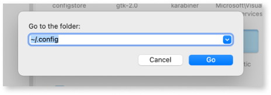
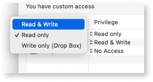
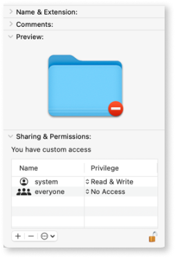
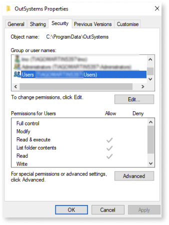

# Cross-platform Service Studio cannot be launched due to missing permissions to create the configuration folder

## Symptoms

Cross-platform Service Studio doesn't load properly. The splash screen doesn’t disappear and a dialog is shown to warn users about missing permissions in the configuration folder.

## Cause

OutSystems cross-platform Service Studio needs a local directory to store configurations and other files. This directory is located in the user’s home area, therefore, the cross-platform environment must have permissions to create and read it (both in Windows and MacOS). However, in some cases, those permissions are lost.  

## Solution

Set the correct permissions to create the configuration folder.

### MacOS

#### **Using Terminal**

1. Search for **Terminal.app** in MacOS Spotlight and open it.

    

1. Go to the `~/.config` folder.

1. Set the owner and permissions for the **OutSystems** folder where `user` corresponds to the current `username`.

    * `sudo chown -R <user> Outsystems`

    * `sudo chmod -R 700 OutSystems`

1. Repeat steps 2 and 3 for the **Directory** folder.

    * `~/.local/share/OutSystems`

1. Open the cross-platform Service Studio again.

#### **Using Finder**

1. Search for **Finder.app** in MacOS Spotlight and open it.

    

1. In the top menu, choose go to **Go** -> **Go to the folder**.

1. Enter `~/.config` and click **Go**.

    

1. Select the **OutSystems** folder.

1. Go to **File** -> **Get info**.

1. In the Sharing & Permissions section, select the line that corresponds to your username and change the **Privilege** value to **Read & Write**.

    
    
    If your username isn’t listed in the Name column:

    a. Click the lock icon and enter your password.
    
    b. Click the **Add+** button to add a new user.

    

    c. Select the line that corresponds to your username and change the **Privilege** value to **Read & Write**.

1. Click the icon and choose **Make __ the owner**.

1. Click the  icon and choose **Apply to enclosed items**.

    

1. Repeat steps a-c for the Directory folder `~/.local/share/OutSystems`.

1. Open the cross-platform Service Studio again.

For more information, see [Apple’s official guide to change permissions for files and folders on Mac](https://support.apple.com/en-ie/guide/mac-help/mchlp1203/mac).

### Windows

1. Open File Explorer and go to the ``C:\Users\<user>\AppData\Local`` folder changing ``user`` to your username.

1. Right click the **OutSystems** folder.

1. Select the **Security** tab.

    

1. In the **Group or username** section, select your username.

1. In the **Permissions** section, ensure that the **Modify** and **Read & execute** permissions have the **Allow** setting enabled.Otherwise, click the **Edit** button and enable the missing privileges.

1. Open the File Explorer again and go to the ``C:\ProgramData`` folder.

1. Right click the **OutSystems** folder and select **Properties**.

1. Select the **Security** tab. 

1. Ensure that the **Users** group has the **Read & execute**, **List folder contents**, and **Read** permissions.

    

1. Open the cross-platform Service Studio again.
