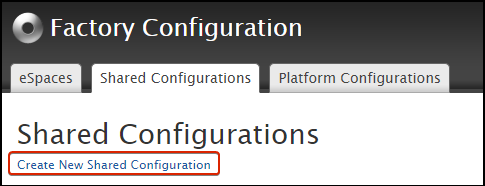
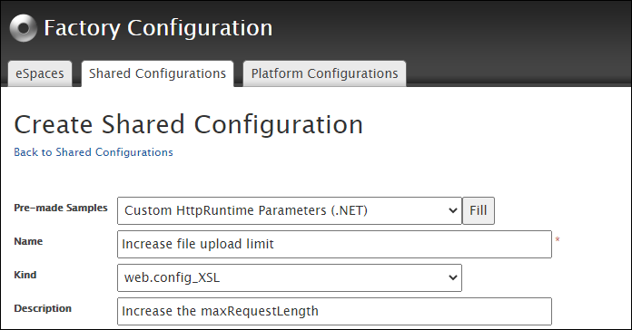
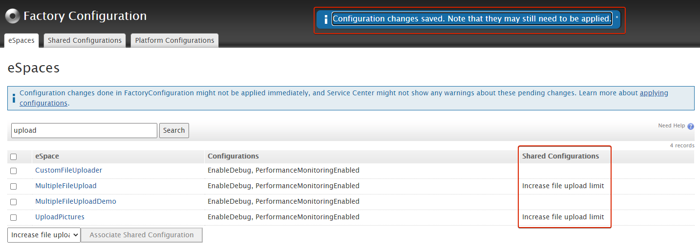

# Altering file upload limits in OutSystems apps

To upload large files on your applications, you may need to increase the maximum request length allowed by the application server.

When this limit is lower than the size of the uploaded file, the file upload will fail and the following error is logged at the [Error Logs](https://success.outsystems.com/Documentation/11/Managing_the_Applications_Lifecycle/Monitor_and_Troubleshoot/View_the_Environment_Logs_and_Status):

```
Message:

Error uploading to 'myserver': System.Web.HttpException: Maximum request length exceeded.

Stack:

   at System.Web.HttpRequest.GetEntireRawContent() 
   at System.Web.HttpRequest.get_InputStream() 
   at System.Web.Services.Protocols.SoapServerProtocol.Initialize() 
   --- End of inner exception stack trace --- 
   at System.Web.Services.Protocols.SoapServerProtocol.Initialize() 
   at System.Web.Services.Protocols.ServerProtocol.SetContext(Type type, HttpContext context, HttpRequest request, HttpResponse response)
```

## Increasing upload limits of your applications

Increasing these limits involves increasing the `maxRequestLength`and `maxAllowedContentLength`parameters of the web.config file associated with that application. However, this alteration shouldn't be done directly in the web.config file on the server: every time an eSpace is republished, the web.config file is regenerated and any custom configurations are lost. The Platform Server forces this behavior to ensure all the configurations are correct.


Instead, to ensure alterations to the web.config files at the application level are persistent, the [Factory Configuration component](https://www.outsystems.com/forge/component-overview/25/factory-configuration) should be used.

### Create a shared configuration

1. Open Factory Configuration on the browser and login with your LifeTime credentials.
1. In the **Shared Configurations** tab click **Create New Shared Configuration**.
    
    

1. On the **Pre-made Samples** drop-down, choose **Custom HttpRuntime Parameters (.NET)** and click **Fill**.
1. Choose a meaningful name for this configuration and input it on the **Name** field.
1. Under **Kind** select 'web.config_XSL'.
1. Optionally, enter a **Description**.

    

1. In the **Value** field, use the following template at the end of this section.

    The value of `maxRequestLength` is defined in KBytes and in the example above, is set to 409600 KBytes (400 MB). You may change it to a value that fits your needs.

    The values of `maxAllowedContentLength` should match values of `maxRequestLength` but they're defined in bytes. In the example, the value 419430400 bytes is used (400 MB). You may change it to a value that fits your needs.

1. Click **Create**.

**Template**

Use the template as instructed in the section.

```xml
<?xml version="1.0" encoding="UTF-8"?>
<xsl:stylesheet xmlns:xsl="http://www.w3.org/1999/XSL/Transform" version="1.0">
   <xsl:output method="xml" indent="yes" encoding="UTF-8" />
   <xsl:template match="@*|node()">
      <xsl:copy>
         <xsl:apply-templates select="@*|node()" />
      </xsl:copy>
   </xsl:template>
   <xsl:template match="/configuration/system.web/httpRuntime">
      <xsl:copy>
         <xsl:apply-templates select="@*|node()" />
         <xsl:attribute name="maxRequestLength">409600</xsl:attribute>
      </xsl:copy>
   </xsl:template>
   <!-- If the element "system.webServer/security" does not exist, add it.-->
   <xsl:template match="system.webServer[not(security)]">
      <system.webServer>
         <xsl:apply-templates select="@*|node()" />
         <security>
            <requestFiltering>
               <requestLimits maxAllowedContentLength="419430400" />
            </requestFiltering>
         </security>
      </system.webServer>
   </xsl:template>
   <!--If the element "system.webServer/security/requestFiltering" does not exist, add it.-->
   <xsl:template match="system.webServer/security[not(requestFiltering)]">
      <security>
         <xsl:apply-templates select="@*|node()" />
         <requestFiltering>
            <requestLimits maxAllowedContentLength="419430400" />
         </requestFiltering>
      </security>
   </xsl:template>
   <!--If the element "system.webServer/security/requestFiltering/requestLimits" does not exist, add it. -->
   <xsl:template match="system.webServer/security/requestFiltering[not(requestLimits)]">
      <requestFiltering>
         <xsl:apply-templates select="@*|node()" />
         <requestLimits maxAllowedContentLength="419430400" />
      </requestFiltering>
   </xsl:template>
   <!-- If the attribute "system.webServer/security/requestFiltering/requestLimits/@maxAllowedContentLength" does not exist, add it.-->
   <xsl:template match="system.webServer/security/requestFiltering/requestLimits[not(@maxAllowedContentLength)]">
      <xsl:copy>
         <xsl:apply-templates select="@*|node()" />
         <xsl:attribute name="maxAllowedContentLength">419430400</xsl:attribute>
      </xsl:copy>
   </xsl:template>
</xsl:stylesheet>
```

### Apply the shared configuration to the apps

Once the shared configuration is created in Factory Configuration, you can chose the eSpaces it should be applied to:

1. While still in Factory Configuration, switch to the **eSpaces** tab.
1. Locate the eSpaces to apply the shared configuration and tick them.
1. In the drop-down select the name of the shared configuration:

    

1. Click **Associate Shared Configuration**. You'll see the warning 'Configuration changes saved. Note that they may still need to be applied'. We'll address it in the next step. The shared configurations assigned to each eSpace are displayed in the **Shared Configurations** column in front of each eSpace name:

    

1. Apply the configurations by republishing all the eSpaces you associated the configurations to. Ensure all the references are refreshed.
