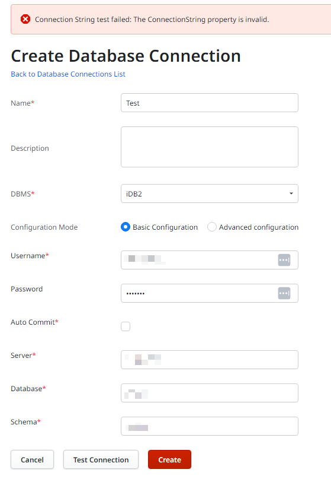

<h1>Testing Connection to an external iDB2 database fails with the error - The ConnectionString property is invalid</h1>

<strong>Symptoms</strong>: "The ConnectionString property is invalid" error, DB2 Test Connection Failure, "Unable to load DLL 'cwbdc.dll'" error

<h2>Precautions</h2>

This Incident Model is only valid for connections to external IBM iDB2 databases.

<h2>Troubleshooting</h2>

In Service Center &gt; Administration &gt; Database Connections, select the relevant connection. Clicking the "Test Connection" button results in the error message: <code class="editorCode">Connection String test failed: The ConnectionString property is invalid.</code>

??????

In the error details (Service Center &gt; Monitoring &gt; Errors), the following stack is observed: 
???????

<code class="editorCode">[1] The ConnectionString property is invalid.</code> 
<code class="editorCode">   at IBM.Data.DB2.iSeries.iDB2Connection.set_ConnectionString(String value)</code> 
<code class="editorCode">   at OutSystems.HubEdition.DatabaseProvider.iDB2.TransactionService.iDB2TransactionService.GetConnectionFromDriver()</code> 
<code class="editorCode">   at OutSystems.HubEdition.Extensibility.Data.TransactionService.BaseTransactionService.GetConnection()</code> 
<code class="editorCode">   at OutSystems.HubEdition.Extensibility.Data.TransactionService.BaseTransactionService.CreateConnection(Int32 numRetries)</code> 
<code class="editorCode">   at oml#wrrwurhs.oml#kpxvvfpt(IIntegrationDatabaseConfiguration rw, String&amp; rx)</code> 
<code class="editorCode">[2] The type initializer for 'IBM.Data.DB2.iSeries.iDB2Constants' threw an exception.</code> 
<code class="editorCode">   at IBM.Data.DB2.iSeries.iDB2ConnectionStringBuilder.set_Item(String keyword, Object value)</code> 
<code class="editorCode">   at IBM.Data.DB2.iSeries.iDB2ConnectionStringBuilder.ParseConnectionString(String&amp; propString, String&amp; propertyInError, Exception&amp; innerException)</code> 
<code class="editorCode">[3] An unexpected exception occurred.  Type: System.DllNotFoundException, Message: Unable to load DLL 'cwbdc.dll': The specified module could not be found. (Exception from HRESULT: 0x8007007E).</code> 
<code class="editorCode">   at IBM.Data.DB2.iSeries.iDB2Constants..cctor()</code> 
<code class="editorCode">[4] Unable to load DLL 'cwbdc.dll': The specified module could not be found. (Exception from HRESULT: 0x8007007E)</code> 
<code class="editorCode">   at IBM.Data.DB2.iSeries.CwbDc.DcDnGetConstants(MpDcConstants&amp; parms)</code> 
<code class="editorCode">   at IBM.Data.DB2.iSeries.iDB2Constants..cctor()</code> 
 

The important clue from the stack above is: <code class="editorCode">Unable to load DLL 'cwbdc.dll'</code>This should mean that the IBM Access Client Solutions has not been installed in the servers of the environment. You may validate this by accessing the servers and verifying if:

<ul>
    <li>Is IBM Access Client Solutions listed in Windows "Apps &amp; Features"?</li>
    <li>Is the folder C:\Program Files (x86)\IBM\ empty?</li>
    <li>Does the directory C:\Program Files\IBM exist?</li>
</ul>

<h2>Incident Resolution Measures</h2>

Install IBM iAccess using the correct installer of IBM iAccess Client Solutions - Windows Application Package.  The filename should be <em>IBMiAccess_v1r1_WindowsAP_English.zip</em>. You can refer to the Installation Checklist of the environment's platform version:

The installer may be downloaded from the following link, <a href="https://www.ibm.com/support/pages/ibm-i-access-client-solutions">https://www.ibm.com/support/pages/ibm-i-access-client-solutions</a>. Note that an IBM account is required for the download.

