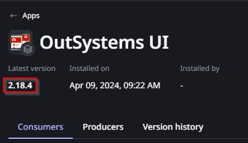

<h1>Error Code OS-APPS-40017 when attempting to Publish applications from different Organizations</h1>

Error Code: OS-APPS-40017 
<strong>Symptoms</strong>: 400 - Bad Request. Title: Missing library dependency, Unable to publish, OS-APPS-40017

<h2>Precautions</h2>

Publishing applications across different Organizations can sometimes result in unforeseen errors related to dependency inconsistencies. Also, please note that the issue described in this Incident Model does not apply to applications installed through the Forge.

<h2>Troubleshooting</h2>

When publishing applications that were originally created in a different Organization, you may be met with the following error:

<code class="editorCode">There was an error connecting to [organization]. Http Error Code: 400 - Bad Request. Title: Missing library dependency</code>

<code class="editorCode">Error Code: OS-APPS-40017</code>

<code class="editorCode">Detail: The application depends on library [library] with key [key] and digest [digest] that is missing. Please publish it before proceeding.</code>

This error may occur with any Library, including Built-in Libraries such as OutSystems UI, which we'll use as an example for this.

When this error occurs, check in ODC Portal of your Target Organizarion whether that library is present, and check its revision as well, it'll be important for the resolution. In the example below, we can see that OutSystems UI is in revision 2.18.4.

If the library referenced in the error doesn't exist in ODC Portal, then you've likely found the cause, and you'll need to publish it first. That said, this issue may occur even when the Library is in fact present.

If the library is already present in the target ODC Organization and you've taken note of its latest version, then do the following:

<ol>
    <li>Access the original source Organization where the application was created.</li>
    <li>Check which revision of the Library it's currently consuming: Most likely, it's not consuming the latest version.</li>
</ol>

If you've confirmed all the points above, you can proceed to Incident Resolution Measures.

<h2>Incident Resolution Measures</h2>

If the library referenced in the error is actually missing from the Organization, then it must be published as the error states. However, even when the library is present, the error may persist, most likely because the application in the original Organization is consuming an older version of the Library.

If you've confirmed that the application in the original Organization is consuming a different version of the library, then please update the library version that the application is consuming. For more information, please read our <a href="https://success.outsystems.com/documentation/outsystems_developer_cloud/building_apps/libraries/#decide-if-to-consume-a-new-version-of-a-library-in-your-app-or-library">Libraries</a> article. If you can confirm that the application is already consuming the same version that is available in your target Organization, then please contact our Global Support team.

