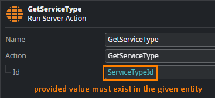

# OS-BERT-60405 - with key inParamId was not found.

<h2>Error Message</h2>

<code class="editorCode">"runtime"."&lt;entity_hash&gt;" with key 'inParamId' was not found.</code>

<h2>Cause</h2>

Typically, this occurs when a provided parameter value (e.g. an identifier) for such an entity action does not exist (for comparison, an Aggregate would simply return an empty list, but a Get entity action expects a result).

<h2>Impact</h2>

Aggregates, or other types of Data/Entity Actions, can end in errors.

<h2>Recommended Action</h2>

 First, you must find the place where the error is occurring - to do this, you can go to the <strong>Traces</strong> in <strong>ODC Portal</strong> and select one of the error traces.

<ul>
    <li>Below is an example where you can also see the inParamId parameter within the SQL statement, and which column this parameter value is not found in: 
    </li>
    <li>Alternatively, you may also follow the <strong>stack trace</strong> of the error to find the action/aggregate where the issue occurs: 
    </li>
</ul>

Once you know where the error occurs, you must ensure that the provided value is neither NULL nor a non-existent value for that particular entity:

<h2>More info</h2>

It's important to note that <code class="editorCode">inParamId</code> is just the name used for input parameters in prepared statements in ODC.

Prepared statements can take parameters: values that are substituted into the statement when it is executed. <a href="https://www.postgresql.org/docs/current/sql-prepare.html">Read more about prepared statements in the PostgreSQL official documentation.</a>

 

