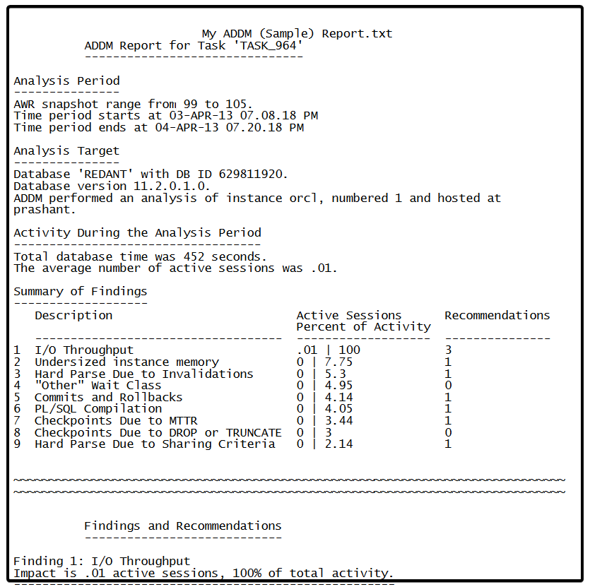

# Database (AWR and ADDM) reports

To troubleshoot database performance, you can get the following two types of reports.

## ADDM report

ADDM automatically detects and reports on performance problems with the database, such as:

  * Adding CPUs or changing the I/O subsystem configuration
  * Changing initialization parameter settings
  * Hash partitioning a table or index, or using automatic segment-space management (ASSM)
  * Using the cache option for sequences or using bind variables
  * Running the SQL Tuning Advisor on high-load SQL statements or running the Segment Advisor on hot objects
   
**ADDM example report**
        

## AWR report
AWR has valuable information such as:
  * CPU Statistics
  * Wait Time Statistics
  * Workload Profile
  * Sessions

**AWR example report**
        

To get AWR and ADDM reports, follow these steps:
    
**AWR report**: [https://docs.oracle.com/database/121/TGDBA/compare\_stats.htm#TGDBA272]
        
**ADDM report In command line**:
        
 * `cd $ORACLE\_HOME/rdbms/admin`
 * `SQL> @addmrpt.sql`
 * `Input begin snap\_id and end snap\_id`
