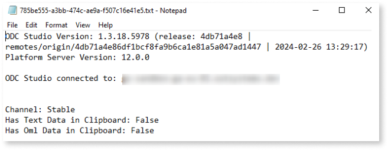

# ODC Studio logs

## ODC Studio report

When an unexpected error occurs in ODC Studio, you'll get an **Unexpected Error** window. In this window, you can obtain the error report to send to OutSystems Support.

To get the ODC Studio report, follow these steps:

1. Click **You can help us fix this…** to expand the window if it's not expanded.
   

2. Click **See diagnostics report** to open the report in a text editor.
   

3. Save the report as a text file. If you need help from OutSystems support but don't have an open support case yet, you can use the link to open one by going to the Support Portal.

4. Click **Continue** to close the window.

To troubleshoot an ODC Studio behavior that doesn't generate errors, collect the diagnostics report:

1. Open ODC Studio.

2. Replicate the behavior that needs to be investigated.

3. Click on **Help**.

4. Click on **Give Us Feedback**.

